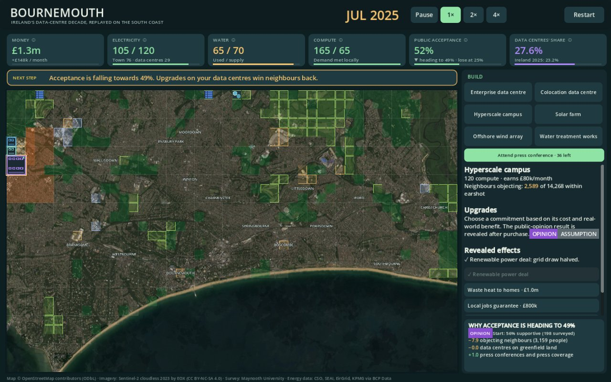
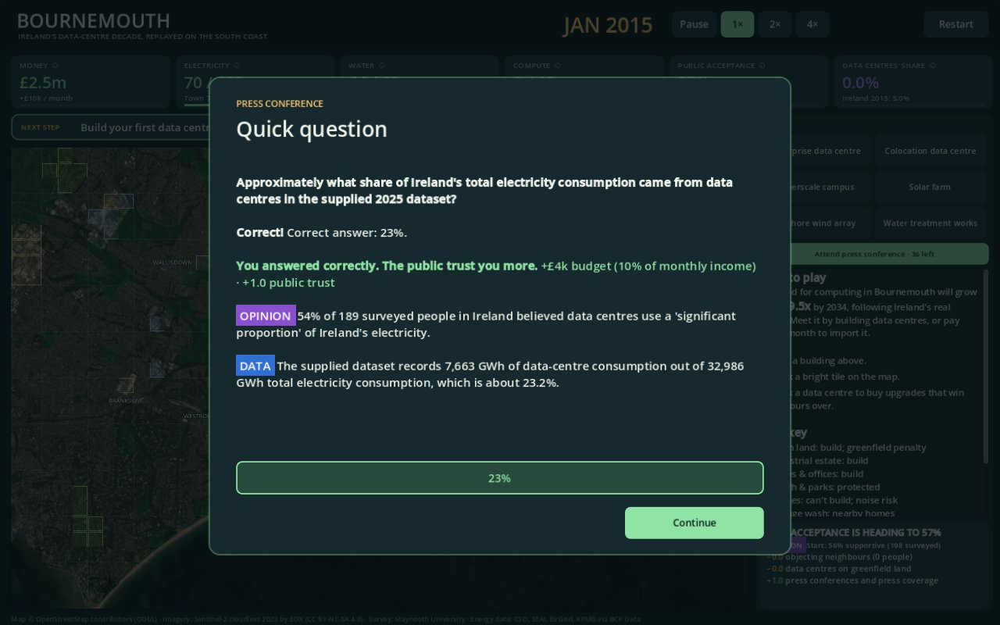

# Bournemouth: Compute & Community

🏆 **2nd place overall and winner of Best Use of Data** at the Bournemouth University induction hackathon *Data Centres: Behind the Headlines* (September 2026).

A town-builder game on a real satellite map of Bournemouth. You replay **Ireland's data-centre boom**: from 2015 to 2034, the town's demand for computing grows about 9.5× along Ireland's real electricity curve. Build data centres to keep up, but every one uses electricity and water and annoys the homes around it. Lose the public or run out of money and the council shuts you down.



## Data, opinion and assumption

The brief asked us to make the supplied data playable without misrepresenting it. Every number in the game is labelled as one of three things:

- **DATA:** a sourced measurement, such as CSO electricity figures, EirGrid renewables or KPMG data-centre types.
- **OPINION:** what people said in the Maynooth University survey of 200 people in Ireland.
- **ASSUMPTION:** a game rule we chose to turn these into gameplay.

Press conferences ask you to guess first, then show what surveyed people believed next to what the data says:



How the survey drives the game:

| In the game | From the survey |
| --- | --- |
| Starting public acceptance, 56% | 110 of 198 respondents support sustainable data centres |
| 35% of residents within earshot object | 69 of 195 said a data centre within 5 km of home is unacceptable |
| Upgrade effects: waste heat 54%, renewables 49%, local jobs 41%, community fund 39% | Share who picked each condition in their top three |
| Penalty for building on greenfield land | 85 of 193 named land use as a top negative impact |

## What we found

- **"Yes, but not near me."** 56% support data centres in general, but only 30% would accept one within 5 km of their home.
- **Belief vs data.** 52% believed all of Ireland's data centres run on fossil fuels. Renewables met about 41% of Ireland's electricity demand in 2025.
- **What wins people over.** Reusing waste heat for local homes (54%) and renewable power (49%) far outranked cheaper energy bills (13%).

The survey and energy data describe Ireland, not Bournemouth, and the survey is a 200-person sample rather than a representative one. The game says "surveyed people in Ireland" wherever it uses it.

## Play it

Windows only. The portable Godot runtime is stored with [Git LFS](https://git-lfs.com/):

```powershell
git clone https://github.com/BardanG05/Data-Center-Hackathon.git
cd Data-Center-Hackathon
git lfs install
git lfs pull
```

Then double-click `town-builder/Play.cmd`. Alternatively, open `town-builder/project.godot` in Godot 4.4 or newer and press F5.

New players get a 2-minute tutorial. Press **F9** during play to skip ahead to 2022.

## What's in the repo

| Path | Contents |
| --- | --- |
| `town-builder/` | The Godot 4 game: scripts, data files, map and automated tests. Its [README](town-builder/README.md) has the full details. |
| `tools/data_import/` | Converts the supplied spreadsheets into the game's JSON data |
| `tools/map_build/` | Builds the Bournemouth grid from OpenStreetMap land use and Sentinel-2 imagery |
| `*.xlsx`, `*.docx`, `*.pptx` | The hackathon brief, survey and datasets as supplied |

## Built with

- [Godot 4](https://godotengine.org/) and GDScript.
- Python for the data pipeline.
- Around 1,900 automated checks covering the data import, rules, question bank and tutorial.

Team: [@BardanG05](https://github.com/BardanG05) and [@AK47-BU](https://github.com/AK47-BU), with help from Claude.

## Credits

- **Survey:** *Social Acceptance of Sustainable Data Centres in Ireland*, Maynooth University.
- **Energy and economic data:** CSO, SEAI, EirGrid, KPMG and Beyond Fossil Fuels, via the supplied `BCP Data.xlsx`.
- **Map data:** © OpenStreetMap contributors, [ODbL](https://opendatacommons.org/licenses/odbl/).
- **Imagery:** Sentinel-2 cloudless 2023 by EOX IT Services GmbH (contains modified Copernicus Sentinel data), [CC BY-NC-SA 4.0](https://creativecommons.org/licenses/by-nc-sa/4.0/).
